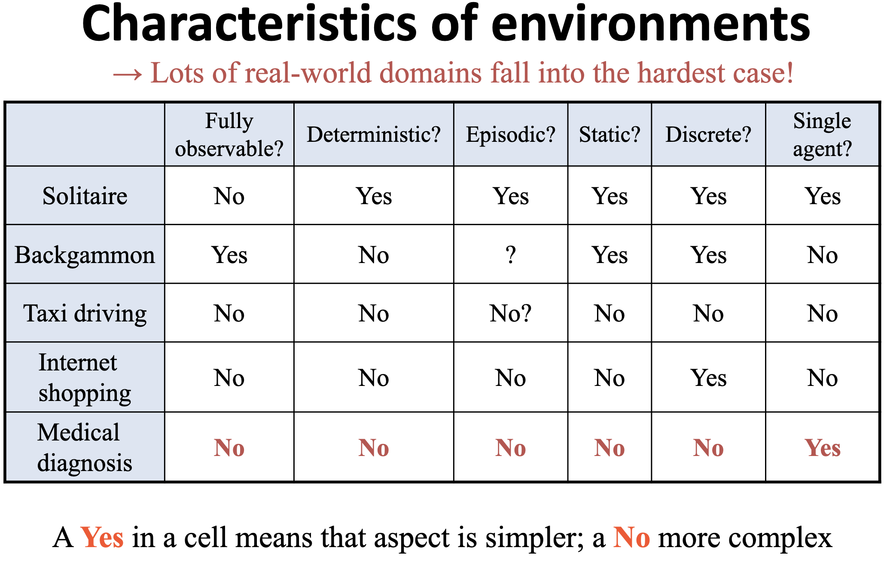

- Agent: anything that can be viewed as perceiving its
**environment** through **sensors** and acting upon that environment through **actuators**

## Intelligent Agent
- <u>Intelligent</u> agents perceive environment via **sensors**(eyes, ears, ...) and act rationally on them with their **effectors**(arms, legs)
- Discrete agents receive **percepts** one at a time, and map them to a sequence of discrete **actions**
- General properties
  - **Reactive** to the environment
  - Pro-active or **goal-directed**
  - **Interacts** with other agents through communication or via the environment
  - **Autonomous**

## Rationality
- Idea <u>rational agents</u> should, for each input, act to maximize expected performance measure based on
  - (1) percept sequence
  - (2) built-in and acquired knowledge
- Rationality -> need a **performance** measure to say how well a task has been achieved
- Types of performance measures: false alarm & false dismissal rates, speed, resource required, effect on environment, money earned, ...

# Properites of Environments
1. Fully/partially observable
    Agent's sensors give complete state of environment needed to choose action: environment is fully observable. Such environments are convenient, freeing agents from keeping track of the environment’s changes.
2. Deterministic/Stochastic
    - Environment is deterministic if next state is completely determined by current state and agent’s action
    – Stochastic (i.e., non-deterministic) environments have multiple, unpredictable outcomes
    - In fully observable, deterministic environments, agents do not need to deal with uncertainty.
3. Episodic/Sequential
    - In episodic environments, subsequent episodes don’t depend on actions in previous episodes
    - In sequential environments, agent engages in a series ofconnected episodes
    - Episodic environments don’t require agent to plan ahead
4. Static/Dynamic
    - Static environments don’t change as agent is thinking
    - The passage of time as agent deliberates is irrelevant
    - The agent needn’t observe world during deliberation
5. Discrete/Continuous
    - If number of distinct percepts and actions is limited, environment is discrete, otherwise it’s continuous
6. Single agent/multiagent
    - in environments with other agents, agent must consider strategic, game-theoretic aspects, for either cooperative or competitive agents
    - Most engineering environments don’t have multiagent properties, whereas most social and economic systems get their complexity from interactions of (more or less) rational agents

# Summary
- **Agents** perceive and act in an environment, have an architecture and are implemented by an agent program
- Ideal agents choses actions to maximize their expected performance, given percept sequence so far
- Autonomous agents use own experience rather than built-in knowledge of environment by designer
- Agent programs map percepts to actions and update their internal state
    – Reflex agents respond immediately to percepts
    – Goal-based agents act to achieve their goal(s)
    – Utility-based agents maximize their utility function
- Representing knowledge is important for
good agent design
- Challenging environments are partially observable, stochastic, sequential, dynamic, and continuous and contain multiple agents