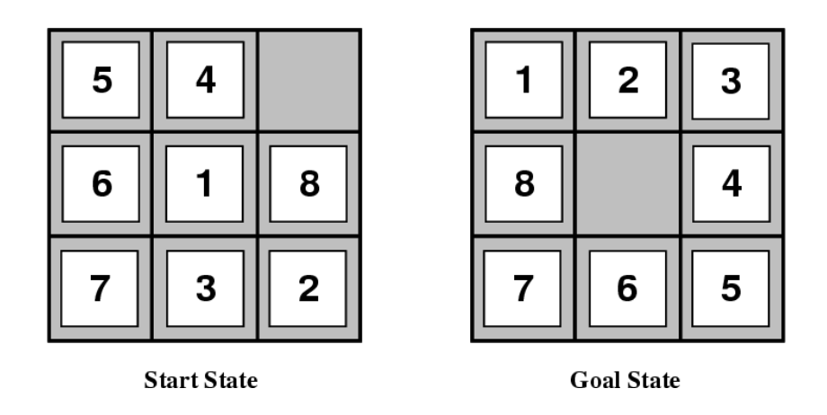
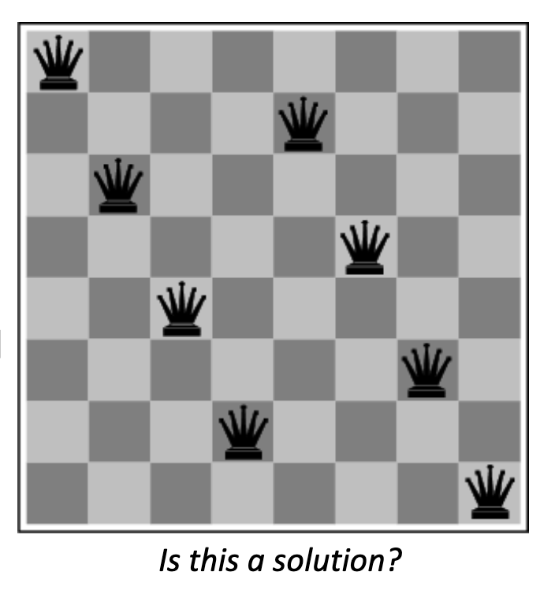

## Example Problem: 8-Puzzle
Given an initial configuration of 8 numbered tiles on a 3*3 board, move the tiles to produce a desired goal configuration

### Building Goad-Based Agents
1. How to represent the **state**?  
2. What is the **goal**? How to recognize it?  
3. What are the possible **actions**?  
4. What relevant information do we encoded to describe states, actions and their effects and thereby solve the problem?

Fully Observable, Deterministic, Episodic, Static, Discrete, Single Agent
#### Representing States
1. A 3*3 array of integer in `{0,...8}`
2. `0` represents the empty space, no integer appears twice
3. Can be represented with a 9-character string "540681732"
#### Goal to be Achieved
- Define a **goal test** function that when applied to a state, returns `True` or `False`
- For this problem
```Python
def isGoal(state):
    # return True if state is a goal
    return state == "123405678"
```
### Actions
#### Definition
Primitive actions: for changing the state. In a deterministic world, not uncertainty in an action's effects (simple model)  
Given action and description of current world state, action completely specifies:  
1. whether action can be applied to the current world (legal?)
2. what state results after action is performed in the current world (i.e., no need for history information to compute the next state)
#### Representing Actions
- Actions are ideally considered as discrete events that occur at an instant time
- Specify four potential moves for "blank" square (better than specify 4 potential moves for each of the 8 tiles)
### Representing States
Usually described as possible **number of states**  
For example:n (estimates are loose uppber bounds)  
- Tic-Tac-Toe has about 3^9 states
- Checkers has about 10^40 states
- Rubik's Cube has about 10^19 states
- Chess has about 10^120 states in a typical game
- Go has 2*10^170 states  
State space size $\approx$ solution difficulty.  
Problem spaces can be infinite $\infty$  
Infinite spaces doesn't mean hard to solve.  
## 8-Queens Puzzle
- Place 8 queens on a chessboard such that no queen attacks any other

## Search in a State Space
Basic idea:  
- Create representation of initial state
- Try all possible actions & connect states that result
- Recursively apply process to the new states until we find a solution or are left with dead ends

To keep track of the connections:  
- Tree data structure  
- Graph data structure (generally the best)  
### E.G. Water Jug Problem
initial state `(3,1)`, goal state `(1,1)`  

### Formalizing state space search
- A state space is a **graph`(V,E)`** where `V` is a set of **nodes** and `E` is a set of **arcs**, each arc is directed from a node to another node.
- **Nodes**: data structures with state description and other info, e.g. node's parent, name of action that generated it from parent, etc
- **Arcs**: instance of actions, head is a state, tail is the state that results from action, label on arc is action's name or id.
- Each arc has fixed, positive cost associated with it corresponding to the action cost
- Each node has a set of successor nodes produced by trying all legal actions that can be applied at node's state
    - Expanding a node = generating its successor nodes and adding them and their associated arcs to the graph
- One or more nodes are marked as **start nodes**
- A **goal test** is applied to a state to determine if its associated node is a goal node
## Formalizing Search
**Solution**: sequence of actions associated with a path from a start node to a goal node  
**Solution Cost**: sum of the arc costs on the solution path
    - If all arcs have same (unit) cost, then solution cost is length of solution (number of steps)
    - Algorithms generally require that arc costs cannot be negative.
**State-space Saerch**: searching through state space fro solution by **making explicit** a portion of an implicit state-space graph to find a goal node.
    - Can't materializing whole space for large problems
    - Initially `V={S}`, where `S` is the start node, `E={}`
    - 